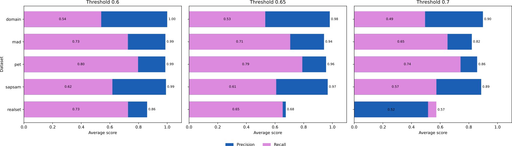

## Results

### Similarity Threshold: 0.65

| Dataset | Files | Precision | Recall |
|---|---:|---:|---:|
| Domain | 25 | 0.98 | 0.53 |
| MAD | 150 | 0.94 | 0.71 |
| PET | 36 | 0.96 | 0.79 |
| SAPSAM | 69 | 0.97 | 0.61 |
| REALSET | 24 | 0.68 | 0.65 |

### Text-model similarity, average per dataset

| Dataset | Files | Precision | Recall | | Dataset | Files | Precision | Recall |
|---|---:|---:|---:|---|---|---:|---:|---:|
| **Similarity Threshold: 0.60** | | | | | **Similarity Threshold: 0.70** | | | |
| Domain | 25 | 1.00 | 0.54 | | Domain | 25 | 0.90 | 0.49 |
| MAD | 150 | 0.99 | 0.73 | | MAD | 150 | 0.82 | 0.65 |
| PET | 36 | 0.99 | 0.80 | | PET | 36 | 0.86 | 0.74 |
| SAPSAM | 69 | 0.99 | 0.62 | | SAPSAM | 69 | 0.89 | 0.57 |
| REALSET | 24 | 0.86 | 0.73 | | REALSET | 24 | 0.52 | 0.57 |

### Interpretation

The results reveal an asymmetric relationship between the information expressed in the process descriptions and the tasks represented in the generated process models. At the representative similarity threshold of **0.65**, precision is substantially higher than recall for four of the five datasets. This indicates that most tasks in the generated process models can be aligned with information expressed in the corresponding process descriptions, whereas a considerable amount of information contained in the descriptions is not directly represented as process-model tasks.

Importantly, the latter should not be interpreted as evidence that this information is irrelevant to the process. Process descriptions may contain contextual information, decision and gateway conditions, temporal constraints, business rules, or other domain-specific information that is relevant to understanding or executing the process but is not represented as an individual process-model task.

The consistent relationship across the tested similarity thresholds further supports that this observation is not specific to the selected threshold.

### REALSET

REALSET differs substantially from the other datasets. Its precision of **0.68** indicates that a considerably larger proportion of generated tasks cannot be directly aligned with the corresponding process descriptions. This suggests that the REALSET process models contain substantially more task-level information that is not explicitly represented in their associated descriptions.

However, the alignment analysis alone cannot determine the source of this additional information; it only establishes that it is not directly identifiable in the descriptions according to the applied similarity criterion.

### Similarity Threshold

The original similarity threshold of **0.70** was established for matching items of comparable length, such as task-to-task or sentence-to-sentence comparisons. However, in the present setting, tasks are compared with process-description sentences, which can differ substantially in length and linguistic structure.

Therefore, applying the original threshold directly would impose a stricter matching criterion on task–sentence comparisons. To account for this difference, the threshold was adjusted to **0.65** for the task–sentence alignment.

### Note

The observed pattern is consistent across the different similarity thresholds. Although the absolute precision and recall values change as the threshold is varied, the overall relationship between the two measures remains similar across thresholds and datasets.

In particular, for most datasets, precision remains substantially higher than recall, while REALSET consistently exhibits noticeably lower precision than the other datasets. This consistency across thresholds indicates that the observed findings are not merely a consequence of selecting a particular similarity threshold for embedding matching.

Rather, the underlying differences in the relationship between the process descriptions and the generated process models are consistently present across the datasets.

### Summary Across Dataset Groups

The results are consistent with the expected characteristics of the three dataset groups:

- **MAD and Domain (simple):** These datasets show broadly consistent text–model relationships, with high precision and comparatively lower recall. This indicates that the generated models are largely aligned with the descriptions, while the descriptions contain additional information beyond the model tasks.

- **SAPSAM and PET (intermediate):** These datasets similarly exhibit high precision and comparatively lower recall, indicating that the generated process models capture a substantial portion of the task-level information expressed in the descriptions, while some descriptive information is not represented as individual process-model tasks.

- **REALSET (complicated):** REALSET shows a markedly different pattern, particularly its substantially lower precision. This is consistent with the expectation that its iteratively refined, human-created models contain information that was not present in the original descriptions.

